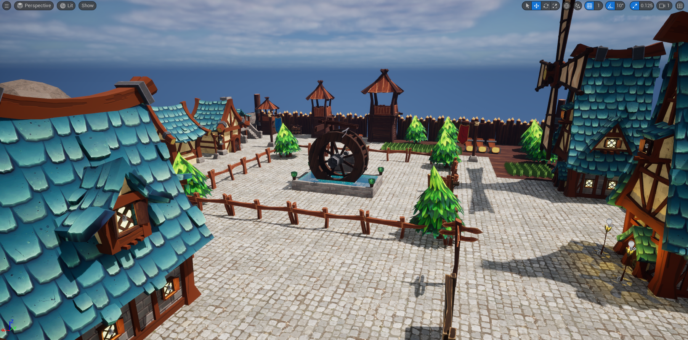
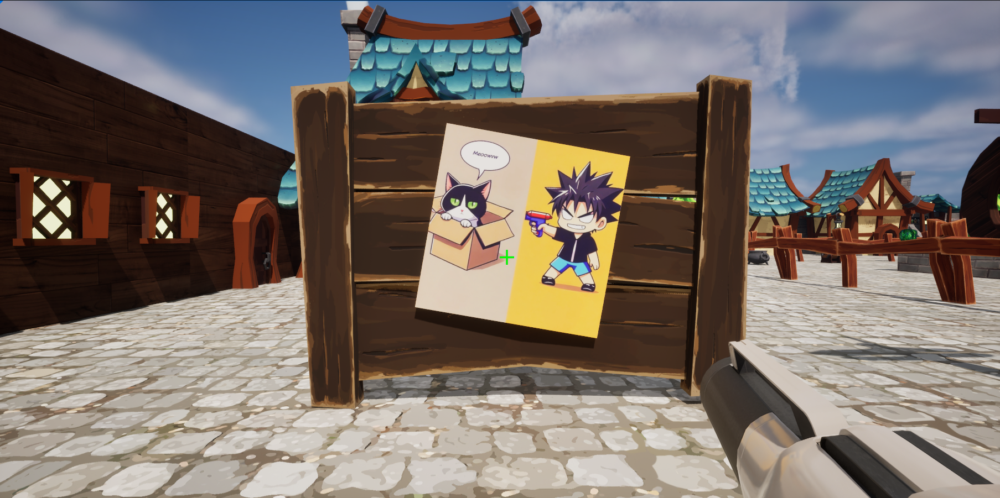
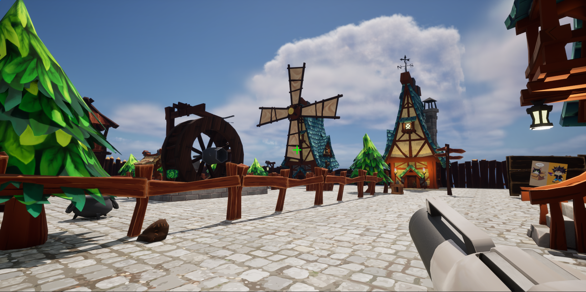
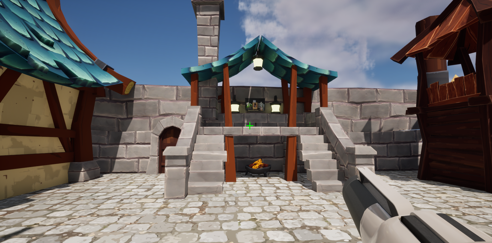
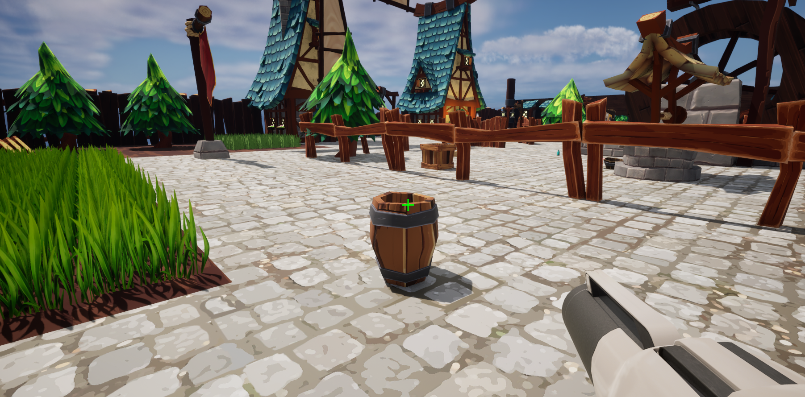

# Softare Engineering - CA1 + CA2 - Beta of game

## Playing with Sleepy

### Story Background
After losing his beloved cat, Sleepy (Sonequinha), and going through difficult times, a software engineer had a a dream where Sleepy came back to play with him. In the dream, she was hidding in many places and she would keep meowing until he could found her.

### Game Play
In a fun and alive environment, a large number of objects (props) are placed at random locations of the map. Only in a few of these objects, Sleepy hides inside and keeps meowing to seek for your attention. Walk around the map, play attention to the sounds around you and once you think you've found Sleepy, shoot the prop. After finding Sleepy in all hidden locations, you will be rewarded.

  
  
  
  
  

---

### To be improved

~~- Some objects are spawned inside static buildings. Need to refine logic to ignore some of the locations. ✅~~
- Mouse sensitivity could be improved
- Change from gun to pointing a finger and asking ("Sleepy, is that you?")
- Implement Observer (Pub/Sub) design pattern whenever possible to reduce coupling

### Ideas for the future

~~- Add timer ✅~~
~~- Add a UI with number of cats, remainig, timer, best score~~
- Limit number of bullets in weapon

---

## Assets and Rights

### Props
Asset Name: FANTASTIC - Village Pack
Creator: Tidal Flask Studios
Source: Fab Marketplace (https://www.fab.com/listings/52529a12-e88e-41a0-8834-b87306f20c24)

### Sounds

#### Soundeffects 
- Cat meow by wesleyextreme_gamer -- https://freesound.org/s/530341/ -- License: Attribution NonCommercial 4.0
- Cat meowing for food 1 by Sadiquecat -- https://freesound.org/s/730098/ -- License: Creative Commons 0
- Cat Meow1.wav by steffcaffrey -- https://freesound.org/s/262312/ -- License: Creative Commons 0
- Cat meow II by tuberatanka -- https://freesound.org/s/110010/ -- License: Creative Commons 0
- Magical thing.wav by jobro -- https://freesound.org/s/198808/ -- License: Attribution 3.0
- water river Guber small stream detailed subtle medium distance stereoXY.wav by Soundholder -- https://freesound.org/s/425874/ -- License: Attribution 3.0

#### Cinematic:
- Song: Avi Snow, Sync - Alright [NCS Release]
Music provided by NoCopyrightSounds
Free Download/Stream: http://ncs.io/Alright 
Watch: http://ncs.lnk.to/AlrightAT/youtube 

#### Game Background Music:
- Song: BIMINI - No Way (with Avi Snow) [NCS Release]
Music provided by NoCopyrightSounds
Free Download/Stream: http://ncs.io/noway
Watch: AT/youtube

- Song: Mo Falk & OVSKY - Home [NCS Release]
Music provided by NoCopyrightSoundsFree 
Download/Stream: http://NCS.io/MOHome
Watch: http://youtu.be/0DXI_ooetEo

#### Gun Sound Effect
- Blaster Shot by UNIVERSFIELD -- https://freesound.org/s/750234/ -- License: Attribution 4.0

### Images
Images for the cinematic and for the info board close to player spawn were generated interactively using Dall-E via ChatGPT Plus.
- Chat history can be found [here](Docs/chat-history-to-generate-images-with-ai.txt)
- Chat history to generate cat face icon can be accessed [here](https://chatgpt.com/share/675d8ab4-9640-800c-bb1c-db1f856f732c)
